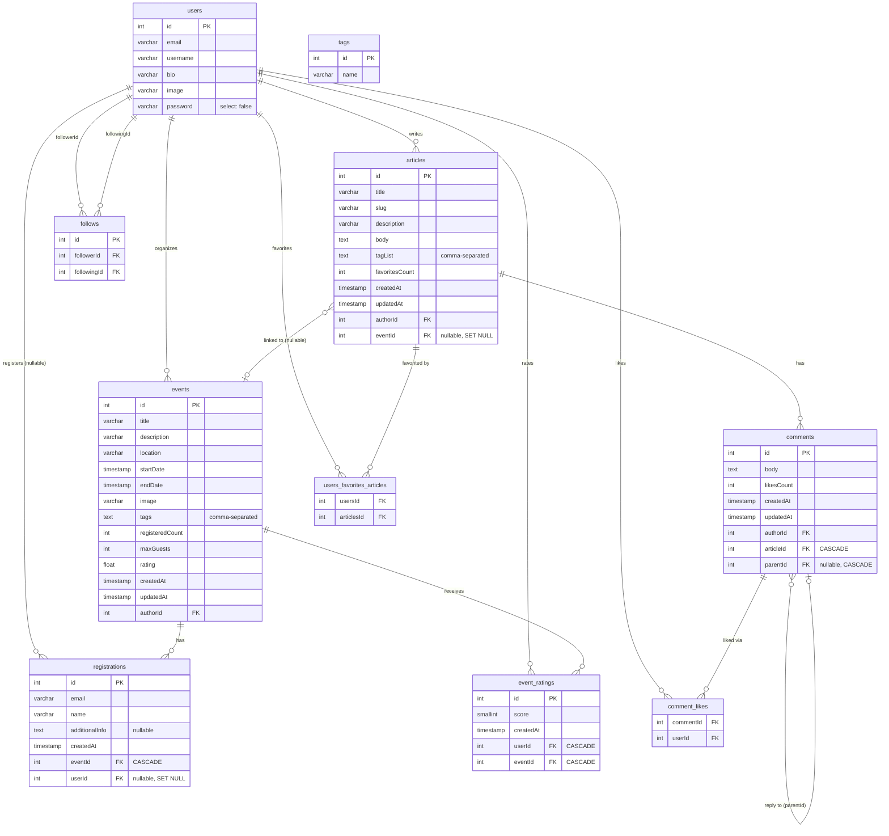

# NestJS API Practice

A RESTful API built with NestJS and PostgreSQL, featuring articles, events, comments, user authentication, and social profiles.

## Tech Stack

- **Framework:** NestJS 11 (Express)
- **Language:** TypeScript 5
- **Database:** PostgreSQL + TypeORM
- **Auth:** JWT (jsonwebtoken + bcrypt)
- **Docs:** Swagger / OpenAPI
- **Package manager:** pnpm

## Features

- User registration, login, and JWT authentication
- Articles with slugs, tags, and favorites
- Nested comments with likes
- Events with registrations and ratings
- User profiles with follow/unfollow
- Global API prefix `/api` with Swagger UI at `/api/docs`

## Prerequisites

- Node.js 18+
- PostgreSQL 12+
- pnpm

## Getting Started

### 1. Install dependencies

```bash
pnpm install
```

### 2. Configure environment

Create a `.env.local` file in the project root:

```env
POSTGRES_USER=nestjspractice
POSTGRES_PASSWORD=your_password
POSTGRES_DB=nestjspractice
JWT_SECRET=your_jwt_secret
PORT=3000
```

### 3. Run migrations

```bash
pnpm db:migrate
```

### 4. (Optional) Seed the database

```bash
pnpm db:seed
```

Seeds 3 tags, 1 test user (`test@example.com`), and 2 sample articles.

### 5. Start the development server

```bash
pnpm start
```

The API will be available at `http://localhost:3000/api`.  
Swagger UI: `http://localhost:3000/api/docs`.

## Scripts

| Command | Description |
|---|---|
| `pnpm start` | Start with nodemon (hot reload) |
| `pnpm build` | Compile TypeScript |
| `pnpm start:prod` | Run compiled build |
| `pnpm lint` | ESLint with auto-fix |
| `pnpm lint:check` | ESLint check (no fix) |
| `pnpm format` | Prettier format |
| `pnpm typecheck` | TypeScript type check |
| `pnpm test` | Unit tests |
| `pnpm test:watch` | Unit tests in watch mode |
| `pnpm test:cov` | Unit tests with coverage |
| `pnpm test:e2e` | End-to-end tests |
| `pnpm db:migrate` | Run TypeORM migrations |
| `pnpm db:create` | Generate a new migration |
| `pnpm db:drop` | Drop database schema |
| `pnpm db:seed` | Run seed migrations |

## API Overview

All endpoints are prefixed with `/api`. Protected routes require the header:

```
Authorization: Token <jwt_token>
```

### Auth

| Method | Endpoint | Auth |
|---|---|---|
| POST | `/users` | — |
| POST | `/users/login` | — |
| GET | `/user` | required |
| PATCH | `/user` | required |

### Articles

| Method | Endpoint | Auth |
|---|---|---|
| GET | `/articles` | optional |
| GET | `/articles/feed` | required |
| POST | `/articles` | required |
| GET | `/articles/:slug` | optional |
| PATCH | `/articles/:slug` | required |
| DELETE | `/articles/:slug` | required |
| POST | `/articles/:slug/favorite` | required |
| DELETE | `/articles/:slug/favorite` | required |

### Comments

| Method | Endpoint | Auth |
|---|---|---|
| GET | `/articles/:slug/comments` | optional |
| POST | `/articles/:slug/comments` | required |
| PATCH | `/articles/:slug/comments/:id` | required |
| DELETE | `/articles/:slug/comments/:id` | required |
| POST | `/comments/:id/like` | required |
| DELETE | `/comments/:id/like` | required |

### Events

| Method | Endpoint | Auth |
|---|---|---|
| GET | `/events` | optional |
| GET | `/events/:id` | optional |
| POST | `/events` | required |
| PATCH | `/events/:id` | required |
| DELETE | `/events/:id` | required |
| POST | `/events/:id/register` | optional |
| DELETE | `/events/:id/register` | required |
| POST | `/events/:id/rating` | required |
| PATCH | `/events/:id/rating` | required |
| DELETE | `/events/:id/rating` | required |

### Profiles & Tags

| Method | Endpoint | Auth |
|---|---|---|
| GET | `/profiles/:username` | optional |
| POST | `/profiles/:username/follow` | required |
| DELETE | `/profiles/:username/follow` | required |
| GET | `/tags` | — |

## Database

Migrations are located in `src/migrations/`.

### Schema Diagram



### Tables Overview

| Table | Description |
|---|---|
| `users` | Accounts — email, username, hashed password, bio, avatar |
| `articles` | Posts with slug, tag list, favorites counter, optional event link |
| `tags` | Standalone tag dictionary (used for filtering) |
| `events` | Events with location, date range, guest cap, aggregated rating |
| `registrations` | Event registrations — authenticated users or anonymous (email+name) |
| `event_ratings` | Per-user event score; unique constraint on `(userId, eventId)` |
| `comments` | Article comments with self-referencing `parentId` for nested replies |
| `follows` | User follow graph via raw FK columns `followerId` / `followingId` |
| `users_favorites_articles` | ManyToMany join — users ↔ article favorites |
| `comment_likes` | ManyToMany join — users ↔ comment likes |

### Relationships Summary

| From | Relation | To | Notes |
|---|---|---|---|
| users | 1→N | articles | `author` — cascade delete not set |
| users | 1→N | events | `author` |
| users | M→N | articles | `favorites` via `users_favorites_articles` |
| users | 1→N | registrations | nullable; `SET NULL` on user delete |
| users | 1→N | event_ratings | `CASCADE` on user delete |
| users | M→N | comments | `likes` via `comment_likes` |
| users | 1→N | follows | as `followerId` (who follows) |
| users | 1→N | follows | as `followingId` (who is followed) |
| articles | N→1 | users | eager-loaded `author` |
| articles | N→0..1 | events | optional link; `SET NULL` on event delete |
| articles | 1→N | comments | `CASCADE` on article delete |
| events | 1→N | registrations | `CASCADE` on event delete |
| events | 1→N | event_ratings | `CASCADE` on event delete |
| comments | N→1 | users | eager-loaded `author` |
| comments | N→1 | articles | `CASCADE` on article delete |
| comments | N→0..1 | comments | self-ref `parentId`; `CASCADE` on parent delete |

## Testing

Unit tests live alongside source files (`*.spec.ts`). E2E tests are in `test/`.

```bash
# unit tests
pnpm test

# e2e tests (requires a running PostgreSQL instance)
pnpm test:e2e

# coverage report
pnpm test:cov
```

E2E tests use per-worker isolated schemas so shards can run in parallel:

```bash
pnpm test:e2e --shard=1/4
```

## CI / CD

GitHub Actions runs on every push to `main` and on pull requests:

1. **Lint, typecheck & unit tests** — fast feedback without a database
2. **E2E tests** — runs against PostgreSQL 16 with 4 parallel shards
3. **Docker build** — builds the production image after tests pass

## Docker

A multi-stage Dockerfile is included. The production image uses `node:24-slim` with `tini` as the init process.

```bash
docker build -t nestjs-practice-api .
docker run -p 3000:3000 --env-file .env nestjs-practice-api
```
